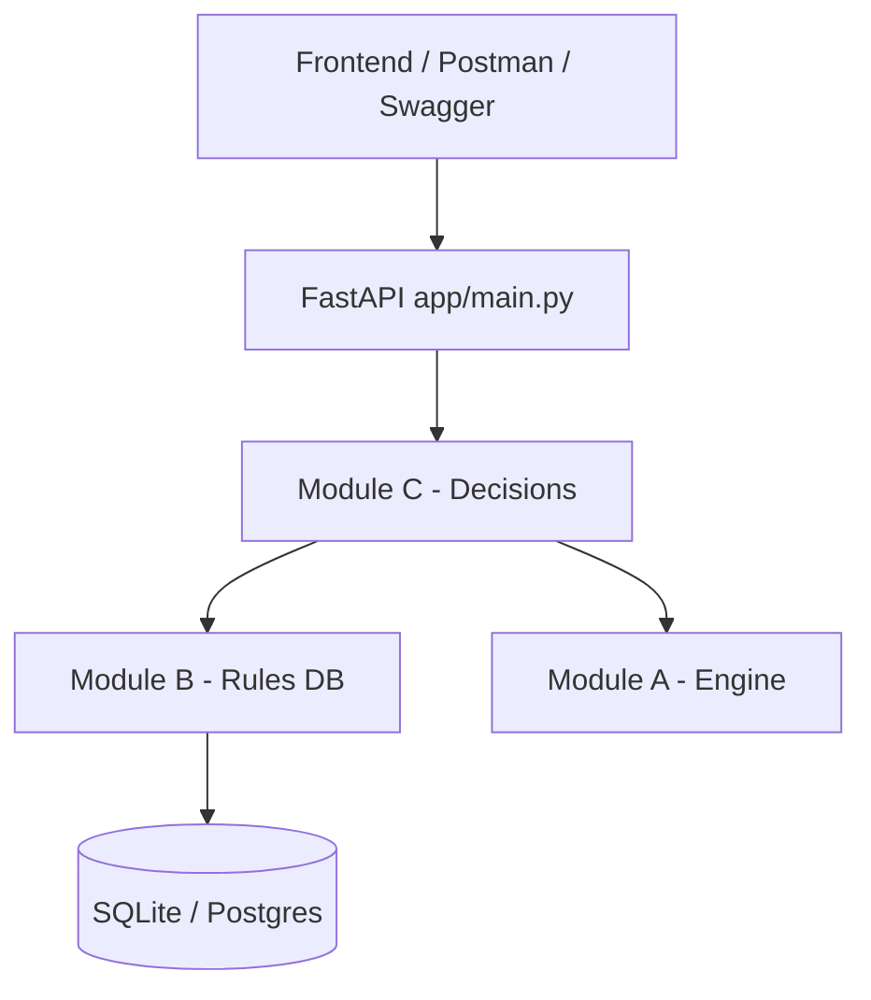

# Finance Decision Engine — How It Works (Simple Guide)

**For Contributor C (Misbah)** — full project overview + your module explained.

---

## 1. What is this project?

This is a **Loan & Credit Decision Engine**.

A bank (or any company) receives a **loan application** as JSON — things like credit score, income, loan amount. The system:

1. Loads **rules** from a database (e.g. “credit score must be ≥ 650”)
2. Checks the application against each rule
3. Returns a **decision**: `APPROVE`, `REJECT`, or `MANUAL_REVIEW`
4. Explains **which rules matched** and **why**

Rules are **data** (stored in DB, changed via API). The engine is **code** (generic logic that reads any rule JSON).

---

## 2. Big picture — 5 modules

| Module | Owner | Folder | One-line job |
|--------|-------|--------|--------------|
| **A** | Contributor A | `app/engine/` | Evaluates one condition JSON against one payload |
| **B** | Contributor B | `app/rules/` | Saves and manages rules in the database |
| **C** | **You** | `app/decisions/` | Runs all rules on an application and picks the final decision |
| **D** | Contributor D | `app/finance/` | Demo loan data, seed rules, documentation |
| **E** | Contributor E | `app/core/`, `docker/` | Config, DB, logging, health, Docker, CI |



**Your module (C) sits in the middle.** You don’t write loan-specific logic. You orchestrate: get rules → evaluate each one → return the answer.

---

## 3. End-to-end flow (one evaluation)

Here’s what happens when someone calls `POST /api/decisions/evaluate`:

```
1. Request arrives with loan JSON (the "context")
        ↓
2. Router (your router.py) receives it
        ↓
3. DecisionEngineService (your service.py) runs:
   a. Ask Module B: "Give me all active rules, sorted by priority"
   b. Wrap the loan JSON in EvaluationContext (Module A)
   c. For EACH rule:
      - Parse condition JSON from DB
      - Call Module A: registry.evaluate(condition, context)
      - Record: matched or not + explanation
   d. Pick final_decision = first matched rule's outcome (lowest priority number wins)
   e. Build human-readable explanation + full trace
        ↓
4. Return DecisionResponse JSON to the client
```

### Simple analogy

Think of a **stack of checklist cards** (rules), sorted by importance (priority):

- You go through each card top to bottom
- Each card asks a yes/no question about the applicant
- Every “yes” is recorded
- The **first “yes”** decides the final answer
- You also report **all** cards that said yes

---

## 4. Your role as Contributor C — exclusively

### What you own

| File | Purpose |
|------|---------|
| `app/schemas/decision.py` | **Contracts** — shape of request/response (Phase 0, agreed with team) |
| `app/decisions/service.py` | **Brain** — `DecisionEngineService` algorithm |
| `app/decisions/router.py` | **API** — HTTP endpoints |
| `tests/decisions/` | **Tests** — prove the algorithm works |

### What you do NOT own

- Condition evaluators (`NUMERIC`, `STRING`, etc.) → **Module A**
- Rule CRUD, database model → **Module B**
- Sample loan payloads, seed script → **Module D**
- Docker, `/health`, CORS → **Module E**

You **use** A and B as black boxes. You call their public methods; you don’t edit their internals.

---

## 5. Your code — file by file

### 5.1 `app/schemas/decision.py` — the shapes

These are Pydantic models (typed JSON schemas).

**Input — `EvaluateRequest`:**
```python
{
  "context": { ... loan application ... },
  "category": "ELIGIBILITY"   # optional — only run rules in this category
}
```

**Output — `DecisionResponse`:**
```python
{
  "final_decision": "APPROVE",           # winner, or "NO_DECISION"
  "matched_decisions": ["APPROVE"],      # all distinct outcomes that matched
  "explanation": "Final decision: APPROVE (...)",
  "rules_evaluated": [ ... ],            # every rule checked
  "rules_matched": [ ... ],              # rules that matched
  "rules_rejected": [ ... ],             # rules that did not match (or skipped)
  "evaluated_at": "2026-07-24T..."
}
```

**`RuleTrace`** — one row per rule evaluated:
- Which rule (`rule_id`, `rule_name`, `priority`)
- Did it match? (`matched`)
- What outcome would it give? (`decision_outcome`)
- Why? (`explanation` — comes from Module A)

---

### 5.2 `app/decisions/service.py` — the algorithm

This is your **main deliverable**.

#### Dependencies (injected in `__init__`)

```python
DecisionEngineService(
    repository=RuleRepository,      # Module B — read rules from DB
    registry=ConditionEvaluatorRegistry,  # Module A — evaluate one condition
)
```

#### `evaluate()` — step by step

| Step | Code idea | Plain English |
|------|-----------|---------------|
| 1 | `repository.list_active_ordered_by_priority(category)` | Get active rules, lowest priority number first |
| 2 | `EvaluationContext(request.context)` | Wrap loan JSON for dot-path lookup (`applicant.creditScore`) |
| 3 | Loop each rule → `_evaluate_rule()` | Check each rule one by one |
| 4 | Split into `rules_matched` / `rules_rejected` | Track who passed vs failed |
| 5 | `final_decision = rules_matched[0].decision_outcome` or `"NO_DECISION"` | First match wins |
| 6 | `matched_decisions` = unique list of outcomes | e.g. both APPROVE and MANUAL_REVIEW if both matched |
| 7 | `_build_explanation()` | One sentence summary for humans |
| 8 | Return `DecisionResponse` | Send JSON back |

#### Priority rule (important!)

Rules are sorted by **`priority` ascending** — **lower number = higher priority**.

Example:
- Rule priority **10** → “Minimum Credit Score” → APPROVE
- Rule priority **20** → “High DTI” → MANUAL_REVIEW

If **both** match, `final_decision = "APPROVE"` (10 wins). Both still appear in `rules_matched`.

#### Error handling (your design choice)

If **one rule is broken** (bad JSON or invalid condition type):

- Log a warning
- Mark it as skipped in `rules_rejected`
- **Continue** evaluating other rules

One bad rule must **never** crash the whole request.

#### `evaluate_bulk()`

Runs `evaluate()` for each request in a list. Used for batch processing.

---

### 5.3 `app/decisions/router.py` — the HTTP layer

Thin layer — no business logic here.

| Endpoint | Body | Returns |
|----------|------|---------|
| `POST /api/decisions/evaluate` | One `EvaluateRequest` | One `DecisionResponse` |
| `POST /api/decisions/evaluate/bulk` | Array of `EvaluateRequest` | Array of `DecisionResponse` |

**Dependency injection:**
```python
get_decision_service(db) → DecisionEngineService(RuleRepository(db))
```

FastAPI creates a DB session per request, builds your service, calls `evaluate()`.

Wired in `app/main.py`:
```python
app.include_router(decisions_router)
```

---

### 5.4 `tests/decisions/` — what you tested

| Test | Proves |
|------|--------|
| Highest priority wins | `final_decision` = outcome of lowest priority number among matches |
| Multiple matches reported | All matches in `rules_matched` and explanation |
| No match → `NO_DECISION` | Empty matches, populated rejects |
| Broken rule skipped | Bad JSON / unknown type doesn’t break good rules |
| Category filter | Only rules in that category are evaluated |
| Bulk evaluate | One response per input request |
| Router tests | HTTP endpoints return 200 with real DB |

Tests use **`FakeRuleRepository`** (mock) so you could develop C before B was finished — as the spec intended.

---

## 6. How your module connects to A and B

### Module A — what you call

```python
from app.engine.registry import ConditionEvaluatorRegistry
from app.engine.context import EvaluationContext

ctx = EvaluationContext(loan_json)
result = registry.evaluate(condition_dict, ctx)
# result.matched → True/False
# result.explanation → "applicant.creditScore (720) GTE 650 — matched"
```

You never import `numeric.py` or `string.py` directly. The **registry** dispatches to the right evaluator.

### Module B — what you call

```python
from app.rules.repository import RuleRepository

rules = repository.list_active_ordered_by_priority(category="RISK")
# Each rule has: id, name, priority, condition_json, decision_outcome, active, ...
```

You only **read** rules. Creating/updating/deleting is B’s job (`/api/rules`).

---

## 7. Design principles (why it’s built this way)

| Principle | Meaning for you |
|-----------|-----------------|
| **Rules are data** | You don’t hardcode “650 credit score” — rules live in DB |
| **Engine is generic** | Module A knows nothing about “loans” — only JSON paths and operators |
| **C is domain-agnostic** | Your service works for any rule set, not just finance |
| **Explainability** | Every response includes traces — auditors can see why |
| **Fail-safe** | One corrupt rule → skip it, don’t 500 the whole API |

---

## 8. Example walkthrough

**Request:**
```json
{
  "context": {
    "applicant": { "creditScore": 720 },
    "risk_flags": { "debtToIncomeRatio": 0.3 }
  }
}
```

**Seeded rules (simplified):**

| Priority | Rule | Condition | Outcome |
|----------|------|-----------|---------|
| 10 | Minimum Credit Score | score ≥ 650 | APPROVE |
| 20 | High DTI | DTI > 0.45 | MANUAL_REVIEW |

**Your service:**

1. Load both rules (priority 10, then 20)
2. Rule 10: Module A says **matched** → trace added to `rules_matched`
3. Rule 20: Module A says **not matched** → trace added to `rules_rejected`
4. `final_decision = "APPROVE"` (first match)
5. `explanation = "Final decision: APPROVE (highest-priority match: 'Minimum Credit Score', priority 10)."`

---

## 9. Frontend (separate repo folder)

The React app lives at **`C:\DTDL-PS4-frontend`** (sibling to backend).

It calls your endpoints:

- **Evaluate page** → `POST /api/decisions/evaluate`
- Shows `final_decision`, badges, and rule traces from your `DecisionResponse`

You didn’t build the frontend — but **your API shape** (`EvaluateRequest`, `DecisionResponse`) is what the UI consumes.

---

## 10. Quick reference — your API

### Evaluate one application

```http
POST /api/decisions/evaluate
Content-Type: application/json

{
  "context": {
    "applicant": { "creditScore": 720, "employmentStatus": "EMPLOYED" },
    "loan": { "amount": 25000, "purpose": "AUTO", "termMonths": 60 },
    "risk_flags": { "hasDefaulted": false, "debtToIncomeRatio": 0.3 }
  },
  "category": null
}
```

### Bulk evaluate

```http
POST /api/decisions/evaluate/bulk
Content-Type: application/json

[
  { "context": { ... } },
  { "context": { ... } }
]
```

---

## 11. Your branch & commits (what you shipped)

Branch: **`feat/decisions-module`**

| Commit | What |
|--------|------|
| `feat(decisions): add DecisionEngineService with evaluation algorithm` | `service.py` |
| `feat(decisions): add evaluate API endpoints and wire router in main` | `router.py` + `main.py` |
| `test(decisions): add evaluation algorithm and API tests` | `tests/decisions/` |

---

## 12. Cheat sheet — “What did C do?”

**In one sentence:**  
You built the **decision orchestrator** — it loads rules from B, evaluates them with A, picks the winning outcome by priority, and returns a full explainable trace via REST API.

**Three files to know cold:**

1. `schemas/decision.py` — request/response contracts  
2. `decisions/service.py` — the algorithm  
3. `decisions/router.py` — `/evaluate` and `/evaluate/bulk`

**One rule to remember:**  
**Lower priority number wins** when multiple rules match.

---

## 13. Run & test your module

```powershell
# All decision tests
pytest tests/decisions -v

# Hit your API (backend running)
Invoke-RestMethod -Method POST -Uri http://localhost:8000/api/decisions/evaluate `
  -ContentType "application/json" `
  -Body '{"context":{"applicant":{"creditScore":720},"loan":{"amount":25000},"risk_flags":{"hasDefaulted":false,"debtToIncomeRatio":0.3}}}'
```

Swagger UI: http://localhost:8000/docs → **Decisions** section.

---

*Document created for Contributor C — Module: Decision Engine & API (`app/decisions/`)*
